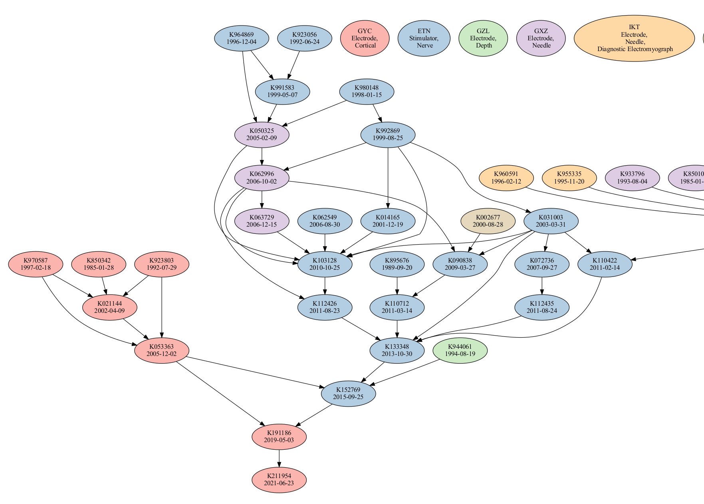

# Install tesseract and graphviz

```
sudo apt-get install tesseract-ocr graphviz
```

# Install requirements

```
pip3 install -r requirements.txt
```

# File sources

Device dataset downloaded from: https://open.fda.gov/apis/device/510k/download/

```
wget https://download.open.fda.gov/device/510k/device-510k-0001-of-0001.json.zip
unzip device-510k-0001-of-0001.json.zip
```

Recall dataset downloaded from: https://open.fda.gov/apis/device/recall/download/

```
wget https://download.open.fda.gov/device/recall/device-recall-0001-of-0001.json.zip
unzip device-recall-0001-of-0001.json.zip
```

Import the JSON data to a SQLite Database

```
python3 db_import.py
```

Scrape the FDA website and download PDFs for 510(k) summary statements.

```
python3 scrape.py
```

Visualize a graph of the 510(k) dependencies

```
python3 visualize.py
```

This should produce a graph like this:




# Preparing the DB for SQL HTTPVFS

```bash
cp devices.db devices-prepared.db
```

```bash
sqlite3 devices-prepared.db
```
```sql
-- first, add whatever indices you need. Note that here having many and correct indices is even more important than for a normal database.
pragma journal_mode = delete; -- to be able to actually set page size
pragma page_size = 1024; -- trade off of number of requests that need to be made vs overhead. 

vacuum; -- reorganize database and apply changed page size
```

# Flagging for manual review
```sql
-- multiple predicate devices
select node_to from predicate_graph_edge GROUP BY node_to HAVING COUNT(node_to) != 1;
```

```sql
-- missing an edge in the graph
select distinct(k_number) from device LEFT JOIN predicate_graph_edge ON device.k_number = predicate_graph_edge.node_to WHERE node_to IS NOT NULL AND device.statement_or_summary = 'Summary';
```

# Problems with the data

* Only a statement is available, not a summary
* A summary should be available, but wasn't on the website
* No predicate device is given in the summary
* A predicate device is in the summary, but it has no 510k entry
* A predicate device is in the summary, but it refers to a trade name and can't be traced back to 510k
